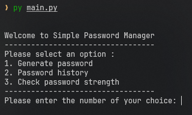

# Simple Password Manager
> This is a personal project from the course on [Boot.dev](https://boot.dev) (Personal Project 1)

A simple CLI password manager tools
 

## Features
- Password Generator : Generate secure password based on user preferences
- Password History : Look up to the saved password
- Password Strength Checker : Analyze the password strength

## Installation
Follow these steps to clone and set up the project on your machine.

### Prerquisites
- [Python 3.x](https://www.python.org/downloads/) 
- [Git](https://git-scm.com/)

### Steps to install
1. Clone this repo

```bash
git clone https://github.com/fsuropaty/simple-password-manager.git

```
2. Navigate to the project directory.
```bash
cd simple-password-manager

```
3. Create virtual environment
It's recommended to use a virtual environment to keep dependencies isolated
```bash
python3 -m venv venv
. .venv/bin/activate # for Linux and Mac, i use WSL2 debian
# or
.venv/Scripts/activate # for Windows
```

4. Install dependencies
```python
pip install -r requirement.txt

```
## Usage
1. Run the application
```bash
python -m main

```
2. Command Options
```bash
python -m main --help

```
## Notes
This project is mainly for learning programming.
Feel free to use it as you see fit.

Password manager i recommend to use is :
[KeepassXC](https://keepassxc.org/)
[Bitwarden](https://bitwarden.com) 
[Lastpass](https://www.lastpass.com/)

### Side Notes
> If you choose to saved the password, the password is saved inside *vault/saved_password.json* and **Unencrypted!**, Do at your own risk!

### Future improvements 
(Hopefully i can implemented it)
- [ ] Encrypt the saved password file
- [ ] Find the password features
- [ ] Delete the selected password
- [ ] Passphrase Generator


